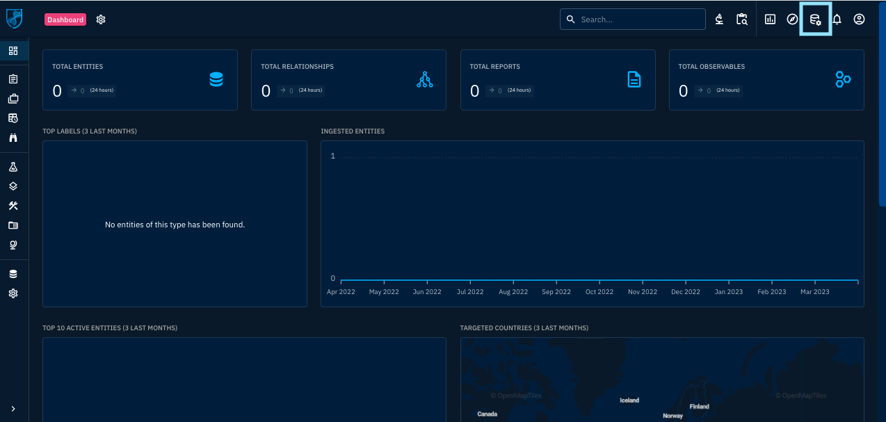
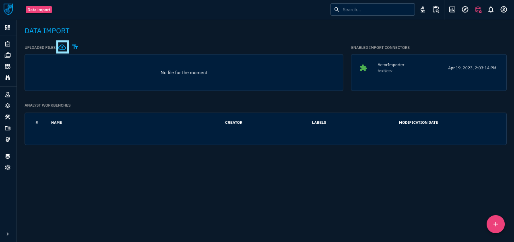
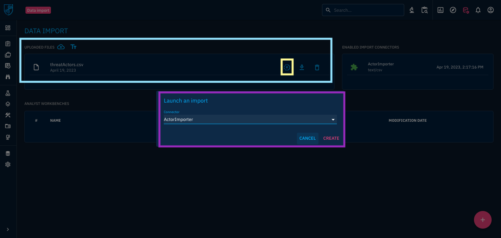

# TIM OpenCTI ActorImporter Connector

## General Description

---

The OpenCTI Actor Importer connector allows a user to ingest a semi-formatted Comma-Separated-Values (CSV) file into the OpenCTI platform.  Currently, the connector supports Organization and Individual imports.

## How it works

---

1. [Example Spreadsheet](./.static/threatActors.xlsx)

   The top row or headers of the CSV file must designate the entity and the attribute name of the destination for the import. The following is just a sample of the fields that can be ingested.  All fields from both Individual and Organization are supported.

   ```
   individual.name
   individual.x_opencti_aliases
   individual.x_mcas_citizenship
   individual.x_mcas_country_of_residence
   individual.x_mcas_gender
   individual.x_mcas_job_title
   individual.x_mcas_eye_color
   organization.name
   organization.x_opencti_aliases
   ```

2. [Example CSV File](./.static/threatActors.xlsx)

   To produce the CSV file from an Excel spreadsheet, from the **File** menu, select **SaveAs**.  Change the **File Format:** to **CSV ITF-8 (Comma delimited) (.csv)** to save the CSV file.

## Setup

---

This connector requires the modifications to extend the STIX language found in the following repos:

[Threat Intel / OpenCTI / Opencti](https://gitlab.324cate.com/threat-intel/opencti/opencti)

[Threat Intel / OpenCTI / Client Python](https://gitlab.324cate.com/threat-intel/opencti/client-python)

[Threat Intel / OpenCTI / Connectors](https://gitlab.324cate.com/threat-intel/opencti/connectors)

[Threat Intel / OpenCTI / Docker](https://gitlab.324cate.com/threat-intel/opencti/docker)

For this reason, it is recommended that the instructions for installing these executables as Docker containers be followed as found in:

```
~/projects/threat_intel/docker/TIM.README.md
```

You will need to configure/create a `./src/config/config.yml` file. An example file would look something like:

```
opencti:
  url: "http://opencti:4000"
  token: "6C2C9EAE-6FF5-4421-B118-74A3CA5AAC20"

connector:
  id: "4656B09A-186A-4CC0-98BA-30F120DA045E"
  type: "INTERNAL_IMPORT_FILE"
  name: "ActorImporter"
  scope: "text/csv" # MIME type or SCO
  auto: false # Enable/disable auto-import of file
  only_contextual: false # Only extract data related to an entity (a report, a threat actor, etc.)
  confidence_level: 100 # From 0 (Unknown) to 100 (Fully trusted)
  log_level: "debug"

import_actor:
  create_indicator: false
```

## To Run

---

1. Login to OpenCTI

2. Go to Data Import

   In the top right menu selection, click into the **Data import and analyst workbenches** option.

   

3. Upload CSV File

   On the Data Import screen, in the upper left, click on the upload icon to select your CSV file of data.  On the right side, you will see that the **ActorImporter Connector** is listed under the **Enabled Import Connectors**.

   

4. Launch File Import

    The successfully uploaded file will be shown on the screen, see the blue box.  As shown in the image, select the icon in the yellow box to **Launch an import of this file**.  When selected, the purple box will pop up to launch the actual import.  Use the drop down menu to select which connector to use during ingest.

   

5. Success!

    A successful import should look like this:

   

### Requirements

- OpenCTI Platform >= 5.6.2

### Configuration

| Parameter                            | Docker envvar                       | Mandatory    | Description                                                                                                                                                |
| ------------------------------------ | ----------------------------------- | ------------ | ---------------------------------------------------------------------------------------------------------------------------------------------------------- |
| `opencti_url`                        | `OPENCTI_URL`                       | Yes          | The URL of the OpenCTI platform.                                                                                                                           |
| `opencti_token`                      | `OPENCTI_TOKEN`                     | Yes          | The default admin token configured in the OpenCTI platform parameters file.                                                                                |
| `connector_id`                       | `CONNECTOR_ID`                      | Yes          | A valid arbitrary `UUIDv4` that must be unique for this connector.                                                                                         |
| `connector_type`                     | `CONNECTOR_TYPE`                    | Yes          | Must be INTERNAL_IMPORT_FILE (this is the connector type).                                                                                                      |
| `connector_name`                     | `CONNECTOR_NAME`                    | Yes          | Option `ActorImporter`                                                                                                                                          |
| `connector_scope`                    | `CONNECTOR_SCOPE`                   | Yes          | Supported scope: text/csv (MIME Type or Stix Object)                                                                                                 |
| `connector_confidence_level`         | `CONNECTOR_CONFIDENCE_LEVEL`        | Yes          | The default confidence level for created sightings (a number between 1 and 4).                                                                             |
| `connector_log_level`                | `CONNECTOR_LOG_LEVEL`               | Yes          | The log level for this connector, could be `debug`, `info`, `warn` or `error` (less verbose).                                                              |
| `template_attribute`                 | `TEMPLATE_ATTRIBUTE`                | Yes          | Additional setting for the connector itself                                                                                                                |
